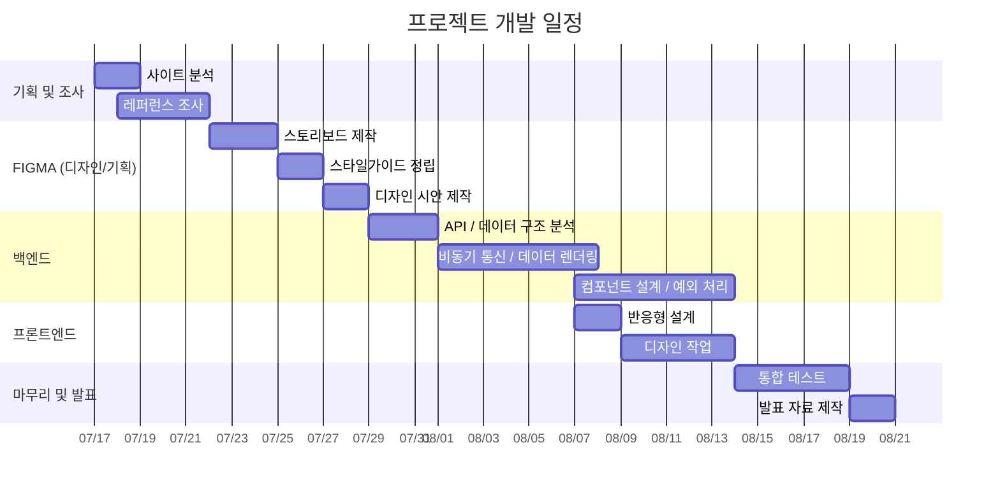

# 🍳 깃깔나는 레시피 - 생성형 AI 기반 맞춤형 레시피 서비스

> 사용자의 조건에 맞는 레시피를 AI로 생성하고, 레시피 탐색·저장·후기·커뮤니티까지 제공하는 레시피 플랫폼

🔗 **배포 사이트 : [깃깔나는 레시피](https://est-fe-13-3st-finalproject.vercel.app/)**

🔗 **발표 자료 : [Figma Slides](https://www.figma.com/deck/oWOYL2FSTLR8VeDpPIxCfm/%EB%B0%9C%ED%91%9C%EC%9E%90%EB%A3%8C?node-id=9-9691&t=cAuiaPQiz8vmvn4l-1)**

---

## 1. 프로젝트 소개

### 📌 프로젝트 개요

**깃깔나는 레시피**는 생성형 AI를 활용하여 사용자의 재료와 음식 종류, 인원수 등의 조건에 맞는 레시피를 생성하고, 다양한 레시피를 탐색하고 공유할 수 있도록 만든 웹 서비스입니다.

AI가 생성한 레시피를 실제 서비스 데이터로 저장할 수 있으며, 일반 레시피 등록과 검색·필터링뿐 아니라 좋아요, 북마크, 후기, 커뮤니티 기능까지 함께 구현했습니다.

Supabase를 활용하여 사용자 인증, 데이터베이스, 이미지 저장소를 구성하고, AI API는 Edge Functions를 통해 호출하여 클라이언트에 API Key가 노출되지 않도록 처리했습니다.

### 🎯 주요 목표

- 사용자 조건을 반영한 **AI 레시피 및 이미지 생성**
- 레시피 **등록·조회·수정·삭제** 기능 구현
- 검색·필터·정렬을 활용한 **레시피 탐색 기능**
- 좋아요·북마크·후기를 활용한 **사용자 참여 기능**
- 레시피와 연결할 수 있는 **커뮤니티 기능**
- Supabase Auth 기반 **사용자 인증 및 프로필 관리**
- Desktop / Tablet / Mobile **반응형 웹 구현**
- 웹 표준·접근성·SEO·성능을 고려한 서비스 최적화

---

## 2. 개발 기간

| 구분               | 기간                        |
| ------------------ | --------------------------- |
| 전체 프로젝트 기간 | **2026.07.15 ~ 2026.08.21** |
| 주요 구현 기간     | **2026.07.28 ~ 2026.08.21** |
| 프로젝트 유형      | **4인 팀 프로젝트**         |



---

## 3. 팀원 소개 및 담당 역할

| 이름       | 담당 영역                                    | 주요 담당 기능                                               |
| ---------- | -------------------------------------------- | ------------------------------------------------------------ |
| **이성희** | **메인 페이지 · 공통 컴포넌트**              | 메인 콘텐츠, 공통 컴포넌트, 주간 식단, 반응형 UI             |
| **남윤동** | **레시피 목록 · 마이페이지**                 | 검색·필터·정렬·페이지네이션, 프로필 및 활동 관리             |
| **주후산** | **AI 레시피 생성 · 레시피 등록**             | AI 레시피 생성, 단계형 등록 폼, 이미지·Storage 연동          |
| **최정원** | **커뮤니티 · 로그인/회원가입 · 레시피 상세** | Auth, 상세·후기, 좋아요·북마크, 커뮤니티 CRUD 및 레시피 연결 |

---

## 4. 기술 스택

| 분류                       | 기술                          |
| -------------------------- | ----------------------------- |
| **Frontend**               | React, JavaScript, TypeScript |
| **Build Tool**             | Vite                          |
| **Routing**                | React Router                  |
| **Styling**                | CSS Modules, CSS              |
| **UI**                     | Material UI, Lucide React     |
| **Backend / Database**     | Supabase Database             |
| **Authentication**         | Supabase Auth                 |
| **Storage**                | Supabase Storage              |
| **Serverless**             | Supabase Edge Functions       |
| **AI**                     | Alan API, OpenAI API          |
| **Deploy**                 | Vercel                        |
| **Version Control**        | Git, GitHub                   |
| **Design / Collaboration** | Figma, Discord, Notion        |

---

## 5. 주요 기능

### 🤖 AI 레시피 생성

- 재료, 음식 종류, 인원수 등 사용자 조건 입력
- 입력 조건을 기반으로 AI 레시피 생성
- 생성 과정에 따른 단계별 Loading UI 제공
- 생성된 레시피 데이터를 등록 페이지로 전달
- AI를 활용한 레시피 관련 이미지 생성
- Supabase Edge Functions를 통한 AI API 호출

### 📝 레시피 등록

- 여러 단계로 나눈 Multi-step Form 구성
- 기본 정보·재료·조리 과정·이미지·공개 옵션 입력
- AI 생성 결과를 등록 폼에 자동 반영
- 일반 사용자 직접 레시피 등록
- 기존 레시피 수정 시 입력 데이터 재사용
- 레시피 이미지 Supabase Storage 저장
- 등록 데이터를 Supabase Database와 연동

### 🔍 레시피 목록

- 레시피 검색
- 음식 종류·난이도·식단 조건 필터링
- 최신순·조회순·좋아요순 등 정렬
- Supabase `range()` 기반 페이지네이션
- 검색 입력 Debouncing 적용
- Header 검색과 레시피 목록 검색 연동
- 데이터 로딩 시 Skeleton UI 제공

### 📖 레시피 상세

- 레시피 기본 정보·재료·조리 과정 조회
- 작성자 프로필 정보 연동
- 레시피 조회수 증가
- 좋아요 및 북마크
- 별점·내용·이미지를 포함한 후기 작성
- 본인이 작성한 후기 수정·삭제
- 관련 레시피 조회
- AI 기반 조리 과정 요약
- AI 요약 중복 생성을 방지하기 위한 DB Claim 처리

### 💬 커뮤니티

- 최신·인기·요리 후기·질문·자유·북마크 카테고리
- 게시글 작성·조회·수정·삭제
- 댓글 작성·수정·삭제
- 게시글 좋아요 및 북마크
- 북마크한 게시글만 모아보기
- 이미지 첨부
- 등록된 레시피 검색 및 게시글 연결
- Masonry 기반 반응형 카드 레이아웃
- Intersection Observer 기반 무한 스크롤
- 최초 진입 시 Skeleton UI 적용

### 🔐 로그인 / 회원가입

- 이메일 회원가입 및 로그인
- Google OAuth 로그인
- Kakao OAuth 로그인
- 비밀번호 재설정
- AuthContext 기반 로그인 상태 관리
- 로그인 후 이전 페이지 복귀
- 로그인 상태에 따른 접근 제어
- `profiles` 테이블을 활용한 닉네임 및 프로필 이미지 관리

### 👤 마이페이지

- 사용자 프로필 조회 및 수정
- 프로필 이미지 Supabase Storage 연동
- 작성한 레시피 관리
- 좋아요한 레시피 조회
- 북마크한 레시피 조회
- 레시피 공개 / 비공개 상태 변경
- 작성 레시피 수정 및 삭제

### 🏠 메인 페이지

- 주요 레시피 및 서비스 콘텐츠 제공
- AI 레시피 생성 기능 연결
- 사용자 재료 기반 콘텐츠 제공
- 주간 식단 UI
- 커뮤니티 콘텐츠 노출
- Desktop / Tablet / Mobile 반응형 UI

---

## 6. 트러블 슈팅

| 문제                           | 원인                                                                                                       | 해결                                                                                                            |
| ------------------------------ | ---------------------------------------------------------------------------------------------------------- | --------------------------------------------------------------------------------------------------------------- |
| **AI API Key 노출 위험**       | Frontend에서 AI API를 직접 호출할 경우 브라우저에서 Key가 노출될 수 있음                                   | API 요청을 **Supabase Edge Functions**로 분리하여 Key를 서버 환경에서만 사용                                    |
| **AI 이미지 데이터 용량 증가** | 생성 이미지를 Base64 상태로 DB에 저장하면 데이터 크기가 크게 증가함                                        | 이미지를 바이너리로 변환해 **Supabase Storage**에 업로드하고 DB에는 URL만 저장                                  |
| **AI 요약 중복 요청**          | 같은 레시피에 여러 사용자가 접근하면 동일한 AI 요약 생성 요청이 동시에 발생할 수 있음                      | DB에 **Claim Token**을 저장해 하나의 요청만 AI 생성을 수행하도록 제어하고 완료 결과를 재사용                    |
| **좋아요 카운트 동시성 문제**  | Frontend에서 조회된 기존 값을 기준으로 직접 증감하면 여러 요청이 겹칠 때 실제 DB 값과 달라질 가능성이 있음 | Supabase **RPC**를 이용해 Database에서 원자적으로 카운트를 변경                                                 |
| **커뮤니티 초기 로딩 지연**    | 게시글·프로필·이미지 데이터를 한 번에 처리하면서 최초 렌더링 시간이 증가                                   | 게시글 우선 조회 후 프로필을 후속 처리하고 **Skeleton UI와 무한 스크롤**을 적용                                 |
| **검색 요청 과다 발생**        | 검색 입력마다 즉시 DB Query가 실행됨                                                                       | **Debouncing**을 적용하여 일정 시간 입력이 없을 때만 검색 실행                                                  |
| **상세페이지 Layout Shift**    | Skeleton과 실제 콘텐츠의 크기 차이로 데이터 로딩 후 화면이 이동                                            | 실제 콘텐츠 구조와 비슷한 Skeleton을 적용해 영역을 미리 확보                                                    |
| **사용자 프로필 정보 불일치**  | 페이지별로 서로 다른 사용자 데이터를 참조하면서 변경된 닉네임이나 이미지가 바로 반영되지 않음              | `profiles`를 공통 사용자 정보로 사용하고 **UserAvatar / AuthContext**를 통해 여러 페이지에서 동일한 데이터 참조 |
| **Mixed Content 경고**         | 일부 기존 프로필 이미지 URL이 HTTP 주소로 저장되어 HTTPS 배포 환경에서 차단됨                              | 프로필 이미지 URL을 정리하고 HTTPS 환경에서 사용할 수 있는 Storage URL을 기준으로 처리                          |

---

## 7. 웹 품질 및 최적화

### ✅ 웹 표준

- **W3C Validator**를 활용한 HTML 웹 표준 검사
- 주요 Error 및 Warning 점검
- 시맨틱 마크업과 올바른 HTML 구조 확인

### ♿ 웹 접근성

- **WAVE** 및 **Lighthouse Accessibility** 검사
- 이미지 `alt` 속성 적용
- 버튼 및 입력 요소 접근성 확인
- 명도 대비 점검
- `aria-label` 등 ARIA 속성 적용
- 키보드 접근 가능 여부 점검

### ⚡ 성능

- Lighthouse Performance 점검
- Skeleton UI를 활용한 초기 로딩 UX 개선
- 이미지 Lazy Loading 적용
- 검색 Debouncing
- 커뮤니티 Infinite Scroll
- 필요한 데이터의 단계적 조회
- Supabase Storage를 활용한 이미지와 DB 데이터 분리

### 🔎 SEO

- 페이지별 `title` 및 `description`
- Canonical URL
- Open Graph 메타데이터
- OG 이미지
- 로그인 / 회원가입 페이지 `noindex`
- `robots.txt`
- `sitemap.xml`
- 레시피 상세 페이지 구조화 데이터 적용

### 🌐 Cross Browsing

- Chrome / Edge 테스트
- 동일한 화면 크기와 배율에서 레이아웃 비교
- 주요 기능 및 UI 동작 확인
- Desktop / Tablet / Mobile 반응형 화면 점검

---

## 8. 폴더 구조

```text
src/
├── components/                         # Header, Footer, Layout, BottomNav, UserAvatar,
│                                       # 인증 가드·확인 모달·SEO 등 공통 컴포넌트
│
├── context/
│   ├── AuthContext.jsx                 # 로그인 사용자 및 프로필 전역 상태 관리
│   └── NotificationContext.jsx         # 전역 알림 상태 관리
│
├── images/                             # 로그인/회원가입 등에서 사용하는 로컬 이미지
│
├── lib/
│   └── supabaseClient.js               # Supabase Client 및 인증 저장소 설정
│
├── pages/
│   ├── Home/
│   │   └── Home.tsx                    # 메인 페이지
│   │
│   ├── CreateAIRecipe/
│   │   ├── CreateAIRecipe.jsx          # AI 레시피 생성 메인 페이지
│   │   ├── components/                 # 조건 입력 폼, 생성 로딩, 결과 표시 컴포넌트
│   │   ├── hooks/                      # AI 레시피 생성 요청 및 상태 관리 Hook
│   │   ├── RecipeJsonToMarkdown.jsx    # AI 응답 데이터를 Markdown 형태로 변환
│   │   └── RecipeResultCard.jsx        # 생성된 레시피 결과 카드
│   │
│   ├── RegistRecipe/
│   │   ├── RegistRecipe.jsx            # 레시피 등록·수정 메인 페이지
│   │   ├── components/                 # Step1~5 입력 단계 및 접근 제어 모달
│   │   └── hooks/                      # 등록 Form 상태 및 Supabase 업로드 로직
│   │
│   ├── RecipeList/
│   │   └── RecipeList.jsx              # 레시피 검색·필터·정렬·페이지네이션
│   │
│   ├── RecipeDetail/
│   │   ├── RecipeDetail.jsx            # 레시피 상세 메인 페이지
│   │   ├── components/                 # 개요, 조리 과정, AI 요약, 후기, 관련 레시피
│   │   ├── hooks/                      # 상세 데이터·좋아요/북마크·후기 상태 관리 Hook
│   │   └── recipeDetailUtils.js        # 상세 페이지 공통 유틸리티
│   │
│   ├── Community/
│   │   ├── Community.jsx               # 커뮤니티 메인 페이지
│   │   ├── components/                 # 피드, 카드, 상세·작성·레시피 선택 모달
│   │   ├── hooks/                      # 게시글 조회·작성 및 댓글 상태 관리 Hook
│   │   └── communityUtils.js           # 커뮤니티 공통 유틸리티
│   │
│   ├── MyPage/
│   │   └── MyPage.jsx                  # 프로필 및 사용자 활동 관리
│   │
│   └── Auth/
│       ├── Login.jsx                    # 로그인 페이지
│       ├── SignUp.jsx                   # 회원가입 페이지
│       ├── UpdatePassword.jsx           # 비밀번호 변경 페이지
│       ├── components/                  # 소셜 로그인, 비밀번호 재설정, Auth UI
│       ├── hooks/                       # Google·Kakao 소셜 로그인 Hook
│       └── authConstants.js             # 인증 관련 공통 상수
│
├── types/                               # Home 및 Navigation 관련 TypeScript 타입 정의
│
├── utils/
│   ├── AlanApi.js                       # Alan API 요청 관련 유틸리티
│   └── userProfile.js                   # 사용자 프로필 관련 공통 유틸리티
│
├── App.jsx                              # 전체 Route 및 페이지 구성
├── App.css                              # App 공통 스타일
├── index.css                            # 전역 스타일
└── main.tsx                             # React Application Entry Point
```
